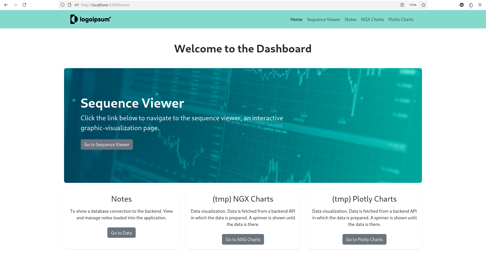
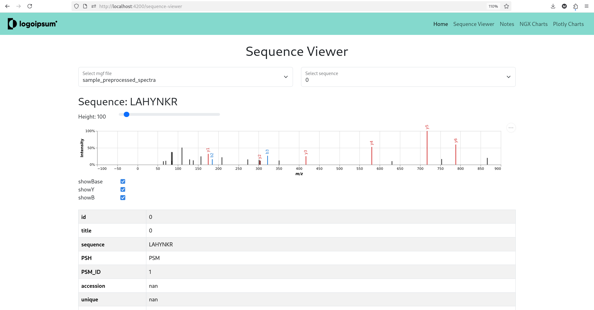
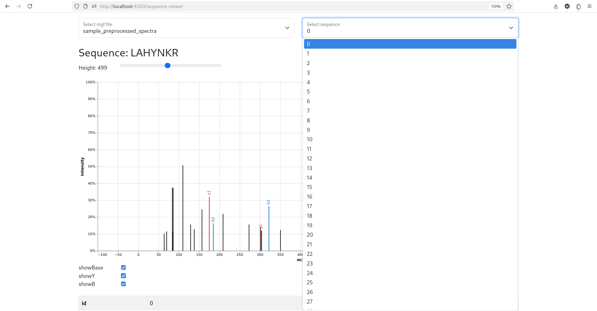
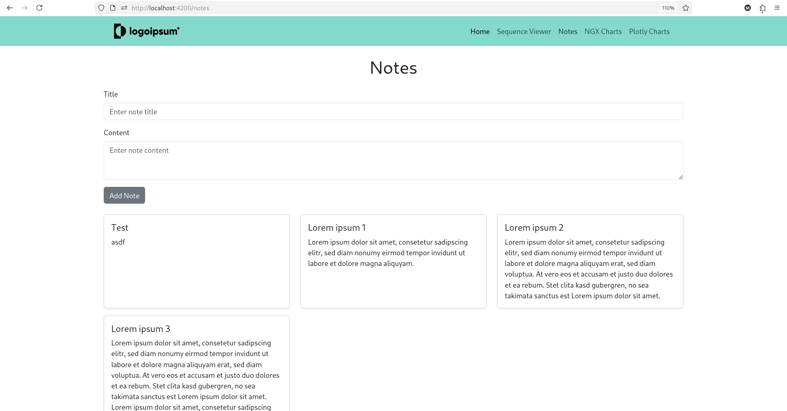
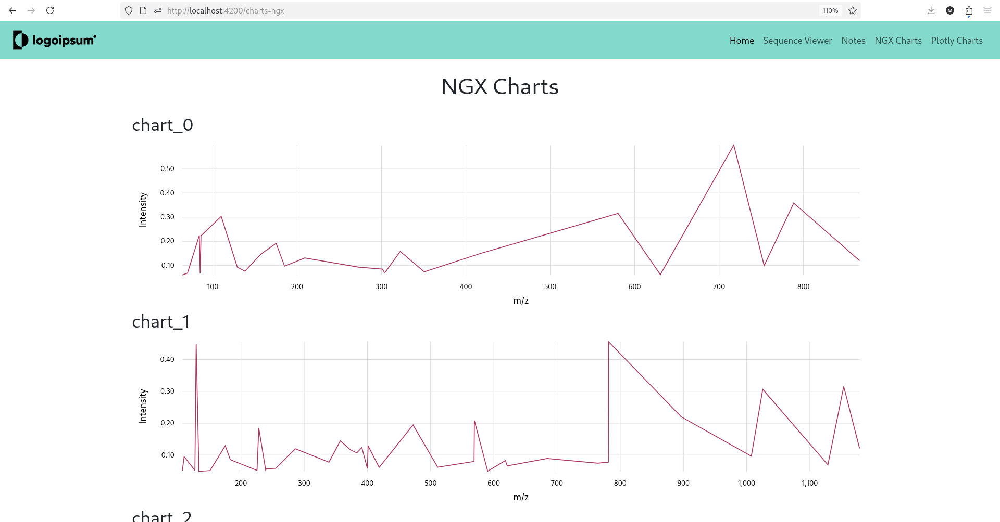
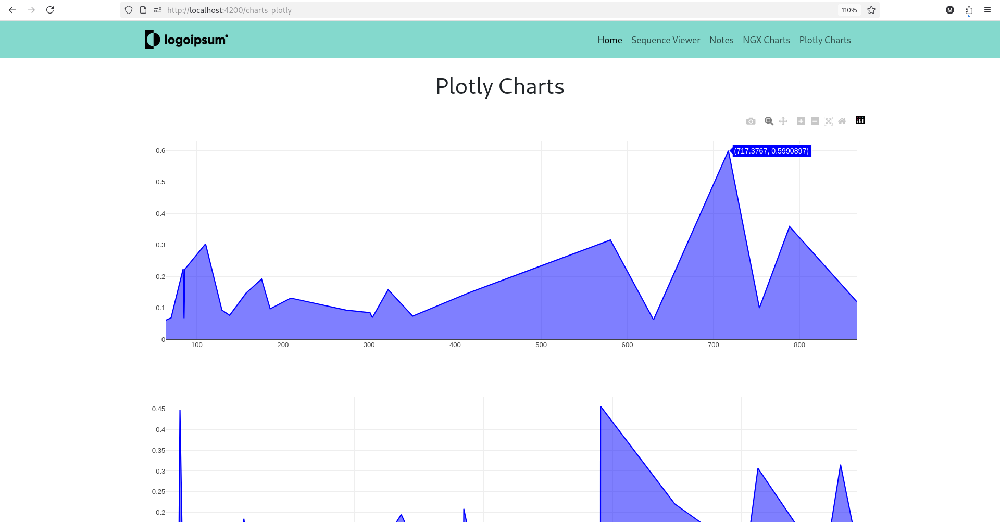
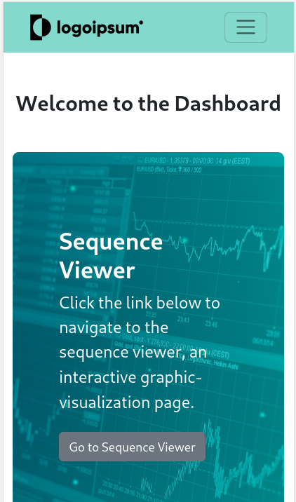
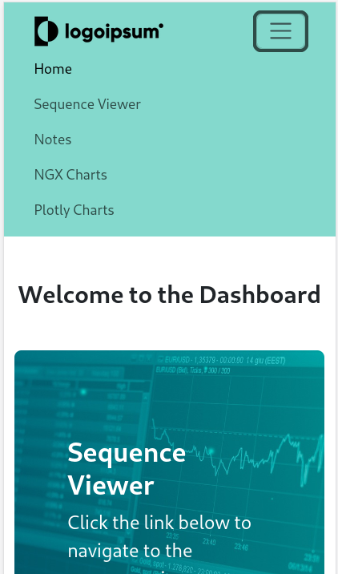
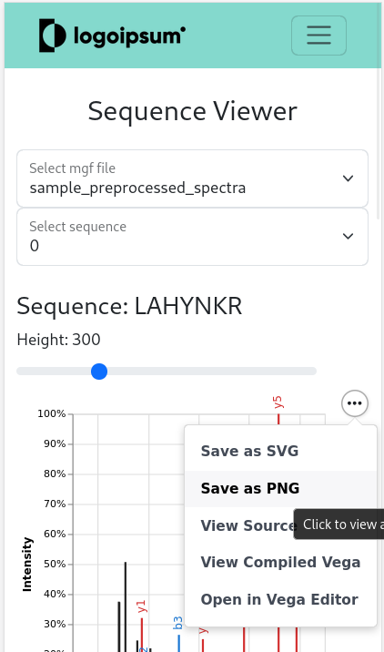

# Application-Project-U-Antwerp

Documentation see in `docs/documentation.md`.

Home page: 



Sequence Viewer page: 



More screenshots from local running instance (for PC and smartphone view) see below.

## Brief explanation of my approach:

I built a web application using Django and Angular. Since spectrum_utils is a Python package (like many other data-processing and ML packages), it is natural to use a Python backend. Several reasons exist for using Django for this purpose, such as its many built-in features, its speed and scalability, and that it is open source. The most popular approach for connecting the backend and frontend servers in web applications is a RESTful API. The frontend requests data from the backend via HTTP. For the frontend, I chose Angular because it is widely used (Google and Microsoft use it), offers rich features, and I am already familiar with it. For designing the UI on the frontend, I used Bootstrap, as it makes it easy to create responsive components.

The spectrum visualization happens as follows: The database stores known mgf files. You select one of those files in the frontend to visualize on the Sequence Viewer page. If that file hasn't been processed by the backend yet, the function `data_processing_for_coding_task` in `backend/api/utils/dataProcessing.py` is called, which reads the mgf and the corresponding mztab file, merges them, and creates JSON files for visualizations using `spectrum_utils.iplot`. Furthermore, the function generates a CSV file that stores sequence information and metadata. If the mgf file has already been processed, the stored information CSV file is returned to the frontend. Now, you can select a sequence(spectrum) in another dropdown. The interactive graphic gets rendered using Vega and the vega-embed JS library. Compared to other libraries, such as plotly or ngx-charts, Vega provides the functionality to visualize the desired spectrum charts. Also, it uses the JSON format that can be generated using `spectrum_utils`.


## How to run the project (local)

### Option 1 (with one command):

Command: 

```
npm start
```

Runs the start script defined in `package.json`: The backend and frontend servers are started in parallel.

### Option 2 (separate backend and frontend):

1. Activate virtual environment:

    ```
    source venv/bin/activate
    ```

2. Start django backend:

    ```
    cd visualizeDataProject
    python manage.py runserver
    ```

3. Start Angular frontend:

    ```
    cd visualizeDataProject/frontend
    ng serve
    ```

Open local Web-App: http://localhost:4200/


## Installation:

Requirements:
- Python 3.11
- node v24.11.0

### Install npm packages

```
npm install
cd frontend
npm install
```

### Install python requirements

Activate virtual environment:

```
source venv/bin/activate
```

Install required packages:

```
pip install -r /path/to/requirements.txt
```

# Screenshots from local running instance

## PC View:

Home page: 


Sequence Viewer page: 





Notes page: 



Ngx charts page:



Plotly charts page:



## Smartphone View:

Home Page:



Home Page (Navigation):



Sequence Viewer:




# References

Python package `spectrum_utils`. See:
- Wout Bittremieux. "spectrum_utils: A Python package for mass spectrometry data processing and visualization." Analytical Chemistry 92, 659--661 (2020) doi:10.1021/acs.analchem.9b04884. 
- Wout Bittremieux, Lev Levitsky, Matteo Pilz, Timo Sachsenberg, Florian Huber, Mingxun Wang, Pieter C. Dorrestein. "Unified and standardized mass spectrometry data processing in Python using spectrum_utils" Journal of Proteome Research 22, 625--631 (2023) doi:10.1021/acs.jproteome.2c00632.
- Bootstrap: Copyright (c) 2011-2025 The Bootstrap Authors
- Vega-embed: Copyright (c) 2015, University of Washington Interactive Data Lab
- Source of image `/frontend/src/assets/business-5475664_1920.jpg`: https://pixabay.com/de/photos/business-chart-graph-graphic-5475664/

