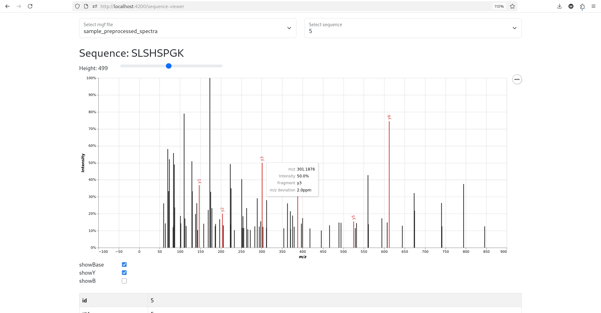

# Application-Project-U-Antwerp

Documentation see in `docs/documentation.md`.

Screenshots from local running instance wee below.


## How to run the project (local)

### Option 1 (with one command):

Command: 

```
npm start
```

Runs the start script defined in `package.json`: The backend and frontend servers are started in parallel.

### Option 2 (separate backend and frontend):

1. Activate virtual environment:

    ```
    source venv/bin/activate
    ```

2. Start django backend:

    ```
    cd visualizeDataProject
    python manage.py runserver
    ```

3. Start Angular frontend:

    ```
    cd visualizeDataProject/frontend
    ng serve
    ```

Open local Web-App: http://localhost:4200/


## Installation:

Requirements:
- Python 3.11
- node v24.11.0

### Install npm packages

```
npm install
cd frontend
npm install
```

### Install python requirements

Activate virtual environment:

```
source venv/bin/activate
```

Install required packages:

```
pip install -r /path/to/requirements.txt
```

# Screenshots from local running instance

Home page: 


Sequence Viewer page: 




Notes page: 


Ngx charts page:


Plotly charts page:


# References

Python package `spectrum_utils`. See:
- Wout Bittremieux. "spectrum_utils: A Python package for mass spectrometry data processing and visualization." Analytical Chemistry 92, 659--661 (2020) doi:10.1021/acs.analchem.9b04884. 
- Wout Bittremieux, Lev Levitsky, Matteo Pilz, Timo Sachsenberg, Florian Huber, Mingxun Wang, Pieter C. Dorrestein. "Unified and standardized mass spectrometry data processing in Python using spectrum_utils" Journal of Proteome Research 22, 625--631 (2023) doi:10.1021/acs.jproteome.2c00632.
- Bootstrap: Copyright (c) 2011-2025 The Bootstrap Authors
- Vega-embed: Copyright (c) 2015, University of Washington Interactive Data Lab
- Source of image `/frontend/src/assets/business-5475664_1920.jpg`: https://pixabay.com/de/photos/business-chart-graph-graphic-5475664/

